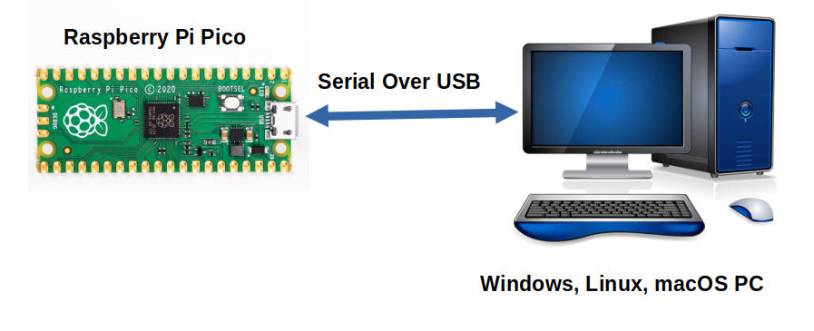

# Telemetrix4RpiPico



The Pico server code may be viewed [here.](https://github.com/mirte-robot/Telemetrix4RpiPico)

# Interface

Data transfers and how to communicate with telemetrix. The protocol is [length_of_msg, msg_id, msg....]. No error correction, no crc and no recovery if byte count is off. All the following messages have the length removed. Send and receive are from the computers perspective.
## Main

### Pico ID
Get a 8 byte unique id of the microcontroller.
`msg_id = 6`, both receive and send.

Send:
```py
[REPORT_PICO_UNIQUE_ID = 6]
```
Receive:
```py
[REPORT_PICO_UNIQUE_ID = 6, id[0], id[1], id[2], id[3],id[4],id[5],id[6],id[7] ]
```

### Get firmware version
Get the firmware version on the MCU with this command. Current version is 1.3.

Send:
```py
[FIRMWARE_REPORT = 5]
```

Receive:
```py
[FIRMWARE_REPORT = 5, MAJOR, MINOR]
```

### Watchdog
At first watchdog message, the watchdog is started. This message and any subsequent message will be acknowledged with the same COUNTER as the computer sent + a constant `boot_id`, that is randomly generated when the watchdog is started. The computer can check the counter to make sure no messages are lost. The constant `boot_id` is for the computer to check that the mcu did not restart. Watchdog timeout is 5s, but modules get a message after 4s to disable( we don't want rogue robots that are uncontrollable).

`msg_id = 32`. Both send and receive.

Send:
```py
[PING_ID = 32, COUNTER]
```

Receive:
```py
[PONG_ID = 32, COUNTER_FROM_COMPUTER, CONST_boot_id]
```

### Get saved id
This id is stored on the MCU to later identify it when multiple microcontrollers are in use
Send:
```py
[GET_ID = 35 ]
```

Receive:
```py
[GET_ID_REPORT = 35, id ]
```

### Save id
Save an id. This will be stored and kept between reboots

Send:
```py
[SET_ID = 36, id]
```

Receive:
```py
[SET_ID_REPORT = 36, id]
```

### Feature detection
Check that some message types are supported. Additional data can be sent back when the feature is available, like the max sonar count.

Send:
```py
[FEATURE_REQUEST = 37, MSG_TYPE]
```

Receive:
```py
[FEATURE_REQUEST_REPORT = 37, MSG_TYPE, OK, ...MSG_DATA]
```

#### Feature detection data
| Command | Reply | Notes |
| ------- | ----- | ----- |
| SONAR_NEW=13 | [MAX_SONARS] | Often limited by the interrupt pins or array size |
| ENCODER_NEW=30 | [MAX_ENCODERS, TYPE_SUPPORT] | Max encoders supported, TYPE_SUPPORT: 1: only single pin counting up, 2: quadrature support, up&down counting |
| SET_PIN_MODE=1 | [MAX_DIGITAL_PINS, ADC_RESOLUTION, PWM_RESOLUTION, MAX_ANALOG_PINS, ...ANALOG_PINS] | Resolution in bits, ANALOG_PINS is list(size is MAX_ANALOG_PINS) of pins used internally in board core, can be 0xff to signal it doesn't exist, can have holes in list |
| SERVO_ATTACH=7 | [MAX_SERVOS] | |
| GET_FIRMWARE_VERSION=5 | [MAJOR, MINOR] | |
| I2C_BEGIN=10 | [TOTAL_I2C_PORTS] | When using the default port pins, use sda=scl=port |


### I2C

#### I2C start
To start an I2C bus, send this command once. Every start command will reset the bus, resetting/losing connection with previous I2C devices.
The i2c_port must be 0 or 1 for the RP2040. port 0 sda pins: ```[0, 4, 8, 12, 20, 16]```, port 1 sda pins: ```[2, 6, 10, 14, 26, 18]```. There is no check on this on the MCU side. The speed will be set to 100k and pull-ups enabled.
Use i2c_port=0, sda=0 & scl=0 for default pins of port 0, Use i2c_port=1, sda=1 & scl=1 for default port 1.

Send:
```py
[I2C_BEGIN = 10, i2c_port, sda, scl]
```

#### I2C write
The I2C port must be started. The ```cust_message_id``` will be sent back as acknowledge. It can be used to keep track on which message was okay. Max data length is 23 (MAX_MSG_LEN = 30 - 7 other bytes). Address must be in range [0..127]. ```no_stop``` is used to not stop the bus, just set it to 0. 
The I2C write timeout is 50ms. The ```write_return_value``` is the amount of written bytes if okay (message_len) or the error value (negative or >128).

Send:
```py
[I2C_WRITE = 12, i2c_port, address, cust_message_id, message_len, no_stop, message]
```

Receive:
```py
[I2C_WRITE_REPORT = 8, i2c_port, cust_message_id, write_return_value]
```

#### I2C read

Register can be 0xFE


TODO: moet meer dan alleen register worden, ook langere berichten
Send
```py
[I2C_READ, i2c_port, i2c_addr, cust_message_id, register, num_bytes, no_stop]
```

Receive:
```py
[I2C_READ_REPORT = 10,  i2c_port, cust_message_id, read_return_value, num_bytes, data]
```

## Sensors

### Sonar
The sonars(hc-sr04) are time-triggered round-robin at a rate of 10Hz to not interfere with eachother. Example: 10Hz per sonar, 3 sonars, timer at 30Hz. The sonar system uses a mutex to make sure writing of a new reading will not mess up reading from it. This might lead to missing sonar readings/messages.

Max distance is 4m. Distance is reported in cm, in 2 bytes: ```distance_hi = int(distance >> 8); distance_low = distance & 0xFF```

max sonars is 4.

Add sonar:
```py

[SONAR_NEW = 13, trigger_pin, echo_pin]
```

Receive:
```py
[SONAR_REPORT = 11, trigger_pin, distance_high, distance_low]
```

### Encoders
2 types are supported, quadrature and single pin. Every edge is counted (up and down, A & B). No interrupts are used, but the encoders are checked at 10kHz. Max of 4 encoders.

Encoder type is 1 for single pin encoder, 2 for quadrature. pin_B is always sent, but must be 0 if not used. The steps are reset on every report, you need to add them to keep a incremental value. The steps need to be interpreted as ```int8_t```, as a quadrature encoder can count down. 

Add encoder:
```py
[ENCODER_NEW = 30, encoder_type, pin_A, pin_B]
```

Receive:
```py
[ENCODER_REPORT = 14, pin_A, steps]
```

### Read pin
To read a digital/analog pin, you need to send a command to set the pin mode and then, on-change, the data will be sent. It's possible to switch modes during operation, even input <-> output. Just send a new ```SET_PIN_MODE``` message.

#### Analog
The pin must be in range of all the possible pins. If it's not an analog pin, then you'll receive nothing or bogus data. differential is the minimal change for the value or it is not reported.

Differential is ```uint16_t```, with ```diff_high = diff>>8``` and ```diff_low = diff&0xFF```. 

Set:
```py
[SET_PIN_MODE = 1, adc_pin, ANALOG_IN = 5, diff_high, diff_low, report_enable ]
```

Receive:
```py
[ANALOG_REPORT = 3, adc_pin, value_high, value_low]
```

#### Digital
Only on change, the data is sent. digital_in_type can be:
- DIGITAL_INPUT = 0
- DIGITAL_INPUT_PULLUP = 3
- DIGITAL_INPUT_PULLDOWN = 4

```report_enable``` can be used to enable or disable reporting. ```1``` for enable.
Set:
```py
[SET_PIN_MODE = 1, pin, digital_in_type, report_enable]
```

Receive:
```py
[DIGITAL_REPORT = 2, pin, value]
```

### Enable/disable reporting
If you want to stop receiving updates. This will also stop modules and sensors from reporting.

Disable:
```
[STOP_ALL_REPORTS = 15]
```
Enable:
```py
[ENABLE_ALL_REPORTS = 16]
```

### Modify reporting
If you only want to en/disable a single pin or type, send this message.

modify_type can be any of
- REPORTING_DISABLE_ALL = 0. Disable analog and digital inputs reporting. Set pin to 0.
- REPORTING_ANALOG_ENABLE = 1. Enable a single analog pin. Needs to have been set as analog pin otherwise UB.
- REPORTING_ANALOG_DISABLE = 3. Disable a single analog pin. Pin in range ```[0..max_pin]```
- REPORTING_DIGITAL_ENABLE = 2. Enable a single digital pin. Needs to have been set as digital input, otherwise UB.
- REPORTING_DIGITAL_DISABLE = 4. Disable a single digital pin.

Send:
```py
[MODIFY_REPORTING = 4, modify_type, pin]
```

## Actuators

### Digital output
First set pin once as output. Afterwards send updates to set new values.

Set:
```py
[SET_PIN_MODE = 1, pin, DIGITAL_OUTPUT = 1]
```
Update:
```py
[DIGITAL_WRITE = 2, pin, value]
```

### PWM output / Servo
TODO: servo is split up, but using pwm output
The PWM mode can be used for servos, as the PWM frequency is set to 50Hz. The value must be in range ```[0, 20000]```. ```value_high = value>>8```, ```value_low = value&0xFF```.

Setup:
```py
[SET_PIN_MODE = 1, pin, PWM_OUTPUT = 2]
```
Update:
```py
[PWM_WRITE = 3, pin, value_high, value_low]
```

#### Servo specific messages
The servo messages, types 7-9, are not supported (yet), as servos can be used with the PWM messages.


## Modules

Module system allows multiple types of sensors/actuators that send and receive data. Not all types might be supported by a board implementation.

### Check module availability
Send this command to check that the board supports the module you want to use.

```py
[MODULE_NEW=33, CHECK=0, module_type]
```

Current modules:
- PCA9685 = 0,                // 16x 12bit PWM
- HIWONDER_SERVO = 1, 
- SHUTDOWN_RELAY = 2, not really working
- TMX_SSD1306 = 3, default oled

### Adding modules:
Send this command with any init information to the board. No reply by default from the system, only if the module implemented something.
Module_num must be consecutive from 0.

```py
[MODULE_NEW=33, ADD=1, module_num, module_type, ...init_data]
```

### Sending data to module:
Same module num as used when adding module.
```py
[MODULE_DATA=34, module_num, ...module_data]
```
### Data from module

```py
[MODULE_REPORT=33, module_num, module_type, ...module_data]
```

### Hiwonder:
Servos are identified based on an id. The actual servo id is only transmitted at init, after that the index of the servo in the init list is used to offload id searching from the pico to the computer.
#### Init:
```py
[ uart_id, rx_pin, tx_pin, len(servos), servo_1_id, servo_2_id, ..., servo_X_id ]
```

#### Set angle:
Message subtype 1

time in ms.
```py
 [ 1, len(servos), servo_1_num, servo_1_angle_high_byte, servo_1_angle_low_byte, servo_1_time_high_byte, servo_1_time_low_byte, ...,  servo_X_angle_high_byte, servo_X_angle_low_byte, servo_X_time_high_byte, servo_X_time_low_byte, ...]
 ```

#### Set enabled:
 ```py
[ 2, len(servos), enabled(1 or 0) servo_1_num, servo_X_num]
```
#### Set all enabled:
```py
[ 2, 0, enabled]
```


## TODO:
- documentation of modules & sensors